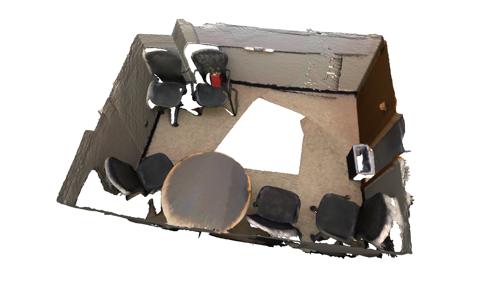
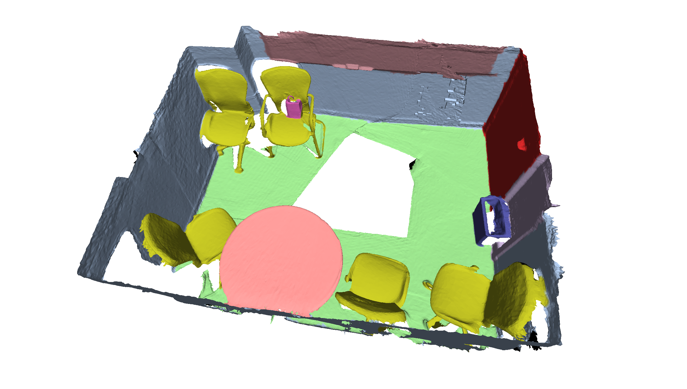

# Scan2CAD-Annotation-Webapp

## Description: 

Annotation webapp used in the research project **Scan2CAD: Learning CAD Model Alignment in RGB-D Scans**:

[Download Paper (.pdf)](https://arxiv.org/pdf/1811.11187.pdf) 

[See Youtube Video](https://www.youtube.com/watch?v=PiHSYpgLTfA&t=1s)


## Demo 

### 1. Step: Select Suitable CAD from a Pool


### 2. Step: Align Scan Object with CAD


## How-To Use

### Get started

1. Clone this repo 
2. `cd repo-name` (enter downloaded repository folder)
3. Install `nodejs` (=`npm`) from [https://nodejs.org/en/](https://nodejs.org/en/)
4. Run `npm install` for client-side and `cd ./server/ && npm install` for server side. 
    * This will install all dependencies specified in `package.json`
5. Run `./build.sh` to compile
    * Run `./watch.sh` to develop with `javascript` (compiles with every change).
7. Edit `./server/config.js` to specify your scan and CAD repository. Also edit the `mongodb` database to save the results.
That means enter credentials to access your `mongodb` server (e.g. *guest:guest* ).
8. Run `./server/run.sh` to start the server.
9. Go to *localhost:8080/Scan2CAD/menu* 

### Create MongoDB database to store the results

`mongodb` is a really nice app and works with `javascript, python, c++, etc.`. So very convinient to use, that's why we will store the annotation result in a `mongo` database:

1. Install [`mongodb`](https://docs.mongodb.com/manual/administration/install-community/)
2. Login with `mongo admin`
3. In the mongo shell create a db and a collection:
    - `use scan2cad`
    - `db.createCollection("correspondences")`
4. Now create a user to login:
    - `use admin`
    - `db.createUser({user : "guest", pwd : "guest", roles : [{role : "readWrite", db : "scan2cad"}]})`
    - `show users`

### Hook your own **scan** and **CAD** repository

We used [ScanNet](https://github.com/ScanNet/ScanNet) as scan dataset and and [ShapeNet](https://www.shapenet.org/) as CAD
dataset to do the annotations. If you want to use it too, then you have to send an email and ask for the data - they usually do it very quickly). However, you can your own datasets with the following steps:

1. All the routing to the datasets is done in `./server/routing/`. Type a name in `./server/config.js` for `dataset_scan` and
`dataset_cad`. Example: `dataset_scan="scannet"` and `dataset_cad="shapenet"`. Probably you will spend most of your time in the `./server/routing` folder because that is where all the data to the webapp is served. 
2. Create a `scannet.js` and a `shapenet.js` file in `./server/routing`. Those files will provide the webapp with the 
approriate meshes, textures, labels, thumbnails etc.
3. Create a `scannet` and `shapenet` folder in `./server./static`. In here you will `symlink` to your actual dataset.

### Notes about the CAD data-structure

You will notice some things that this app asks from you. Of course you can hack the source code and comment out the parts when it wants something from you (it's ok to do it).

#### Thumbnails 

For instance CAD models should have thumbnails. You can just comment out the loading of the thumbnails but the annotation process is much easier with thumbnails (see the video). 

#### Category

Also this webapp wants every CAD models to have two things:

- An `id_cad`: An unique id per CAD model
- A `catid_cad`: a category id. For instance `chairs=001`, `tables=002`, etc. T

Internally it juggles around with both ids.

### Notes about the Scan data-structure

The webapp wants also something extra except the geometry mesh. That is, it asks for a semantically labeled mesh. This is needed because when you hover over the scan and click on a surface point, then the class name is looked up from the labeled mesh: such that you don't have to type it. See following image, (left) class labelled mesh (right) raw mesh

| ScanNet Color             |  ScanNet Labels |
:-------------------------:|:-------------------------:
  |  


If you cannot provide a labelled mesh or don't know how to do it. Then just comment out some parts of the source code or just provide a fake labelled mesh. The webapp will always then say "Maybe: Unknown". And you will have to type in the category yourself everytime you search for a CAD model.

## Citation

If you use this code please cite:

```
@article{avetisyan2018scan2cad,
	title={Scan2CAD: Learning CAD Model Alignment in RGB-D Scans},
	author={Avetisyan, Armen and Dahnert, Manuel and Dai, Angela and Savva, Manolis and Chang, Angel X and Nie{\ss}ner, Matthias},
	journal={arXiv preprint arXiv:1811.11187},
	year={2018}
}
```
